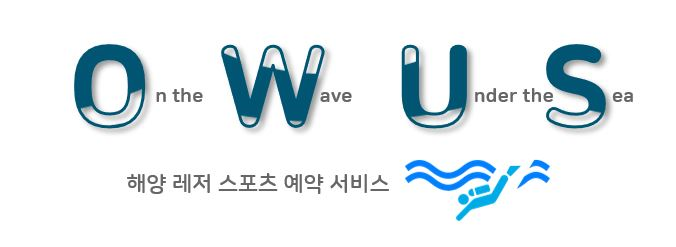
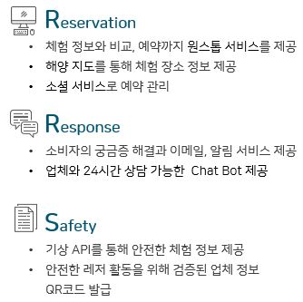

# OWUS - 해양 레저 스포츠 예약 서비스

   
  
   

## 프로젝트 소개 및 기능

OWUS는 오프라인 중심으로 제공되었던 해양 레저 스포츠를 온라인으로 전환하여 소비자와 업체

강사들이 활동 및 소통할 수 있는 광장(HUB)입니다.

   
  
   

 

## 기술 스택

| Spring | Spring Security |  JSP   | MyBatis | Hikari CP | MariaDB |
|:------:|:---------------:|:------:|:-------:|-----------|---------|
| ![spring]  |      ![spring_security]    | ![jsp] | ![mybatis] |   ![hikaricp]        | ![mariadb]     |

## 배운 점 & 아쉬운 점

 

<!-- Stack Icon Refernces -->

[jsp]: ./src/main/java/com/owus/readmeImages/stack/jsp.png
[spring]: ./src/main/java/com/owus/readmeImages/stack/spring.png
[spring_security]: ./src/main/java/com/owus/readmeImages/stack/spring-security-bgd.png
[mybatis]: ./src/main/java/com/owus/readmeImages/stack/mybatis.png
[hikaricp]: ./src/main/java/com/owus/readmeImages/stack/Hikari.png
[mariadb]: ./src/main/java/com/owus/readmeImages/stack/mariadb.png
